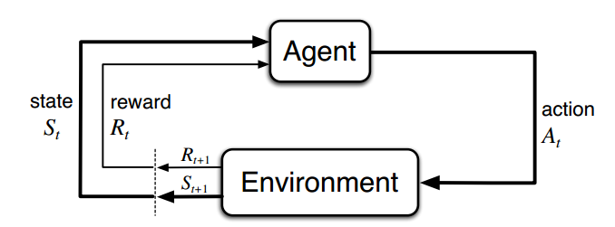

# 3. Finite Markov DecisionProcesses

## Agent和Environment的交互

- 学习者和决策者称为**agent**。
- agent交互的对象，外部环境，称为**Environment**。
- 在时刻t，agent的所处的环境用状态：$S_t \in S$表示，$S$是可能的状态集。假设agent采用了动作$A_t\in A(S_t)$，$A(S_t)$代表在状态$S_t$下可能的动作集。
- 到了下一个时刻t+1，agent收到了一个奖励：$R_{t+1} \in R$，并且发现自己处在一个新的state中：$S_{t+1}$。
- 

## 什么是有限

有限MDP中的有限意味着：状态空间S、动作空间A和奖励空间R都是**离散且有限**的。

## 目标和奖励的区别

- 每个时间节点上，agent都会收到一个奖励的数值：$R_t$。
- 但是，agent的目标应该是：所有时间结点上的奖励的和的最大化。
- 即：$G_t = R_{t+1} +  R_{t+2} + ... + R_T$

## 什么是Episode

一系列的agent和environment**交互序列**。每个episode之间相互不影响，且都是有一个相同的终止状态（terminate state）。

## Continuing Tasks

不同于Episode类的任务，这类任务没有终止状态，也就是说$T = \infty$。因此，如果考虑这类任务，那么$G_t$将是无穷大，于是引入discounting。

## Episode和Continuing Tasks的统一规范

在Episode的尾部加入吸收状态（absorbing state），在此状态下，奖励永远是0，且下一个状态永远是当前状态。

这样收益可以统一使用下面的Expected Discounted Return表示。

## Expected Discounted Return

- 回报：$G_t = R_{t+1} +  \gamma R_{t+2} + ... = \sum_{k=0}^{\infty} \gamma ^k R_{t+k+1}$
- $\gamma$是参数，且$0\leq \gamma \leq 1$，被称为**discount rate**。
- 含义：一个奖励，如果是在k个时间节点以后收到，那么对于当前来说，它的价值是即时奖励的$\gamma^{k-1}$倍。
- 从$G_t$的定义，很容易获得递推式：$G_t = R_{t+1} + \gamma G_{t+1}$

## 马尔科夫性质（Markov property）

- 核心思想：**当前state继承了所有的环境历史信息。**
- $Pr\{S_{t+1}=s', R_{t+1}=r|S_0,A_0,R_1,...,S_{t-1},A_{t_1},R_t,S_t,A_t\} = Pr\{S_{t+1}=s', R_{t+1}=r|S_t,A_t\}$
- 即便state是非马尔科夫的，我们也希望近似到马尔科夫。

## Markov Dicision Processes（MDP）

- **满足马尔科夫性质的强化学习任务称为MDP。**
- 如果state和action空间有限，则称为有限MDP（涵盖了现代强化学习90%的问题）。
- 用$p(s',r|s,a)$表示$Pr\{S_{t+1}={s}', R_{t+1}=r|S_t,A_t\}$，这个条件概率是描绘了整个MDP的动态（Dynamics）。
- state-action期望奖励：$r(s,a) = \mathbb{E}[R_{t+1}|S_t=s,A_t=a]=\sum_{r\in R}r\sum_{s'\in S}p(s', r|s,a)$
- 状态转移概率：$p(s'|s,a) = Pr\{S_{t+1}=s'|S_t=s, A_t=a\}=\sum_{r\in R}p(s', r| s, a)$
- state-action-nextstate期望奖励：$r(s, a, s') = \mathbb{E}[R_{t+1}|S_t=s,A_t=a, S_{t+1}=s'] = \sum_{r\in R}r\frac{p(s',r|s,a)}{p(s'|s,a)}$

## 价值函数

- 关于策略$\pi$的state-value函数：$v_{\pi}(s) = \mathbb{E}_{\pi}[G_t|S_t=s]=\mathbb{E}_{\pi}[\sum_{k=0}^{\infty}\gamma^kR_{t+k+1}|S_t=s]$
- 即，**在使用策略$\pi$的前提下，衡量处于某个state有多好**。
- 关于策略$\pi$的action-value函数：$q_{\pi}(a,s) = \mathbb{E}_{\pi}[G_t|S_t=s,A_t=a] = \mathbb{E}_{\pi}[\sum_{k=0}^{\infty}\gamma^kR_{t+k+1}|S_t=s,A_t=a]$
- 即，在使用策略$\pi$的前提下，衡量处于某个state下，执行某个action有多好。

## Bellman Euqation

- **Bellman Expectation Euqation for** $v_{\pi}$：$v_{\pi}(s) = \sum_a\pi(a|s)\sum_{s',r}p(s',r|s,a)[r+\gamma v_{\pi}(s')]\;\;\forall s \in S$
- 理解：
  - 1.方括号中是根据后继状态的价值重新估计的价值函数，再在动作空间、后继状态空间和动作空间用相应的概率做加权求和。
  - 2.**表达的是某个状态的价值和其后继状态的价值之间的关系。**
- **backup**：是强化学习方法的核心，以时序意义上的回退，用下一个时刻的值去评估当前时刻的值。
- **Bellman Expectation Euqation for $q_{\pi}$**：$q_{\pi}(s,a) = \sum_{s'}p(s',r|s,a)[r+\gamma \sum_{a'}q(s',a')]$
- 

推导：

$v_\pi(s) = \mathbb{E}_\pi[G_t \mid S_t = s]$

$= \mathbb{E}_\pi[R_{t+1} + \gamma G_{t+1} \mid S_t = s]$

$= \sum_a \pi(a \mid s) \sum_{s', r} p(s', r \mid s, a) [r + \gamma v_\pi(s')].$

$q_{\pi}(s,a) = \mathbb{E}_\pi[G_t \mid S_t = s, A_t = a]$

$= \mathbb{E}_\pi[R_{t+1} + \gamma G_{t+1} \mid S_t = s, A_t = a]$

$= \sum_{s',r}p(s',r|s,a)[r+\gamma \sum_{a'}q(s',a')]$

参考资料：https://joshgreaves.com/reinforcement-learning/understanding-rl-the-bellman-equations/

## 最优化价值函数
- $v_*(s) = \underset{\pi}{max}v_{\pi}(s)$
- $q_*(s,a) = \underset{\pi}{max}q_{\pi}(s,a)$
- **Bellman Optimality Euqation for $v_*(s)$**：$v_*(s)=\underset{a\in A(s)}{max}\sum_{s',r}p(s',r|s,a)[r+\gamma v_*(s')]$
- **Bellman Optimality Euqation for $q_*(s,a)$**：$q_*(s,a)=\sum_{s',r}p(s',r|s,a)[r+\gamma \underset{a'}{max}q_*(s', a')]$
- 
